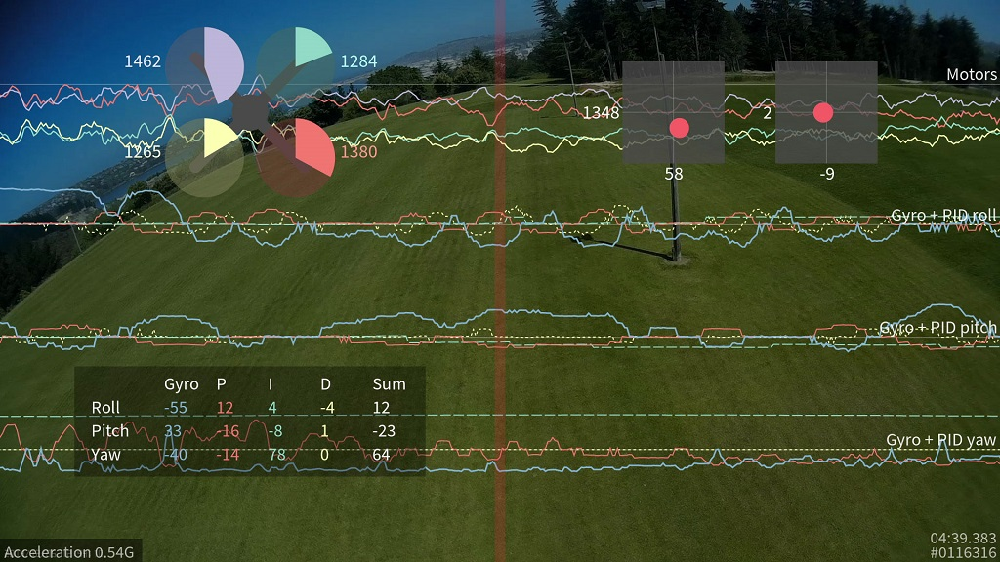

# Youtube ULog Reviewer

PX4's [Flight Review](https://review.px4.io/) is great, as it provides amazing graphs / detailed overview of the [ULog](https://docs.px4.io/main/en/dev_log/ulog_file_format.html) generated from PX4.

However, often it helps to have a video side-by-side with the graph, to actually re-play the moment more visually. Which is already supported for [iNAV](https://github.com/iNavFlight/inav/blob/master/docs/Blackbox.md) and Betaflight, as shown here.

The viewer GUI chrome app that directly outputs rendered video can be found [here](https://github.com/iNavFlight/blackbox-log-viewer).

And a CLI option that can export log data as a transparent background PNG images can be found [here](https://github.com/iNavFlight/blackbox-tools)

## Architecture

The basic flight log analytics will be done similarly to the existing [Flight Review code](https://github.com/PX4/flight_review), which is open source.

And the Youtube video embedded player will be available at the top (or a side), and the graphs will be visible underneath, which can be scrolled to specific timestamps user is interested in.

